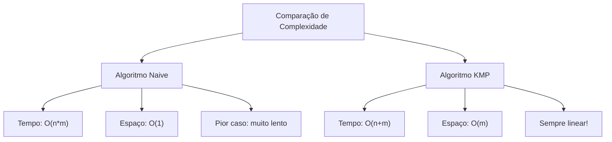

# Algoritmo KMP (Knuth-Morris-Pratt)

!!! abstract "Definição"
    O algoritmo KMP é um algoritmo eficiente de busca em strings que evita retrocessos desnecessários no texto. Ele pré-processa o padrão para construir uma tabela de "failure function" (função de falha) que permite saltos inteligentes quando ocorre uma falha na comparação.

## Conceito e Motivação

### O Problema do Algoritmo Naive

No algoritmo naive, quando encontramos uma falha, voltamos uma posição e recomeçamos a comparação do zero:

```
Texto:    "ABABCABABA"
Padrão:   "ABABA"

Posição 0: ABABA vs ABABA ❌ (falha no 5º caractere)
           ^^^^?
Posição 1:  BABA vs ABABA ❌ (volta ao início do padrão)
            ^
```

### A Solução KMP

O KMP reconhece que quando há uma falha, **já sabemos parte da informação**. Não precisamos voltar ao início do padrão!

```
Texto:    "ABABCABABA"
Padrão:   "ABABA"

Posição 0: ABAB? vs ABABA ❌ (falha no 5º caractere)
           ^^^^
           Mas "AB" no início do padrão = "AB" que já vimos!
           Podemos pular direto para comparar a partir do 3º caractere
```

## Conceitos Fundamentais

### Tabela LPS (Longest Proper Prefix which is also Suffix)

A tabela LPS armazena, para cada posição do padrão, o tamanho do maior prefixo próprio que também é sufixo.

**Exemplo:** Padrão "ABABA"

```
Posição:  0  1  2  3  4
Padrão:   A  B  A  B  A
LPS:      0  0  1  2  3
```

**Por quê?**
- Posição 0: "A" → não há prefixo próprio → LPS[0] = 0
- Posição 1: "AB" → não há prefixo que seja sufixo → LPS[1] = 0  
- Posição 2: "ABA" → "A" é prefixo e sufixo → LPS[2] = 1
- Posição 3: "ABAB" → "AB" é prefixo e sufixo → LPS[3] = 2
- Posição 4: "ABABA" → "ABA" é prefixo e sufixo → LPS[4] = 3

## Implementação em Python

### Construção da Tabela LPS

```python linenums="1"
def build_lps_table(pattern):
    """
    Constrói a tabela LPS (Longest Proper Prefix which is also Suffix)
    
    Args:
        pattern (str): Padrão para o qual construir a tabela
    
    Returns:
        list: Tabela LPS
    """
    m = len(pattern)              # (1) Comprimento do padrão
    lps = [0] * m                 # (2) Inicializa tabela com zeros
    length = 0                    # (3) Comprimento do prefixo-sufixo atual
    i = 1                         # (4) Constrói a tabela LPS
    lps = build_lps_table(pattern)
    
    positions = []                # (5) Lista para armazenar resultados
    i = 0                        # (6) Índice para o texto
    j = 0                        # (7) Índice para o padrão
    
    # (8) Loop principal de busca
    while i < n:
        # (9) Se caracteres coincidem
        if pattern[j] == text[i]:
            i += 1               # (10) Avança no texto
            j += 1               # (11) Avança no padrão
        
        # (12) Se encontrou o padrão completo
        if j == m:
            positions.append(i - j)  # (13) Adiciona posição (início do match)
            j = lps[j - 1]           # (14) Usa LPS para próxima busca
        
        # (15) Se há mismatch após pelo menos um match
        elif i < n and pattern[j] != text[i]:
            if j != 0:
                j = lps[j - 1]   # (16) Usa LPS para evitar retrocesso
            else:
                i += 1           # (17) Se j=0, apenas avança no texto
    
    return positions
```

## Análise de Complexidade

### Complexidade Temporal

- **Construção da tabela LPS**: O(m)
- **Busca principal**: O(n)
- **Total**: O(n + m)

**Por que O(n + m)?**

1. **Cada caractere do texto é examinado no máximo uma vez**
2. **Backtracking no padrão não aumenta a complexidade** (devido à tabela LPS)
3. **Construção da LPS é linear** no tamanho do padrão

### Complexidade Espacial

- **O(m)** para a tabela LPS
- **O(k)** para armazenar resultados (k = número de ocorrências)

### Comparação com Algoritmo Naive



## Exemplo Passo a Passo

Vamos buscar o padrão "ABABA" no texto "ABABCABABA":

### 1. Construção da Tabela LPS

```
Padrão: A B A B A
Índice: 0 1 2 3 4
LPS:    0 0 1 2 3
```

### 2. Busca KMP

```
Texto:    A B A B C A B A B A
Índice:   0 1 2 3 4 5 6 7 8 9
Padrão:   A B A B A
          0 1 2 3 4

Passo 1-4: Match A B A B
Passo 5: text[4]='C' ≠ pattern[4]='A'
         j=4 ≠ 0, então j = lps[3] = 2
         Continua comparando text[4]='C' com pattern[2]='A'
         
Passo 6: text[4]='C' ≠ pattern[2]='A'  
         j=2 ≠ 0, então j = lps[1] = 0
         Continua comparando text[4]='C' com pattern[0]='A'
         
Passo 7: text[4]='C' ≠ pattern[0]='A'
         j=0, então i++
         
Continue a busca a partir de text[5]...
```

## Prós e Contras

### Vantagens

1. **Eficiência**: Complexidade O(n+m) sempre
2. **Sem retrocesso**: Nunca volta no texto
3. **Previsível**: Performance consistente
4. **Otimizado**: Evita comparações desnecessárias

### Desvantagens

1. **Complexidade de implementação**: Mais difícil que naive
2. **Uso de memória**: Precisa da tabela LPS
3. **Overhead**: Para padrões muito pequenos pode ser mais lento
4. **Pré-processamento**: Tempo adicional para construir LPS

## Casos de Uso

### Quando usar KMP?

1. **Textos grandes**: Quando n >> m
2. **Buscas repetidas**: Mesmo padrão, textos diferentes
3. **Padrões com repetições**: Onde naive seria muito lento
4. **Performance crítica**: Quando O(n×m) é inaceitável

### Exemplos Práticos

#### 1. Busca em Editores de Texto

```python linenums="1"
def search_in_file(filename, pattern):
    """Busca padrão em arquivo usando KMP"""
    try:
        with open(filename, 'r', encoding='utf-8') as file:
            content = file.read()
            positions, comparisons = kmp_search(content, pattern)
            
            return {
                'filename': filename,
                'pattern': pattern,
                'occurrences': len(positions),
                'positions': positions,
                'comparisons': comparisons,
                'text_length': len(content)
            }
    except FileNotFoundError:
        return {'error': f'Arquivo {filename} não encontrado'}
```

#### 2. Análise de Sequências de DNA

```python linenums="1"
def find_dna_sequence(dna_string, target_sequence):
    """
    Busca sequência específica em string de DNA
    DNA: apenas A, T, G, C
    """
    # Valida se são sequências de DNA válidas
    valid_chars = set('ATGC')
    if not all(c in valid_chars for c in dna_string.upper()):
        raise ValueError("String de DNA inválida")
    if not all(c in valid_chars for c in target_sequence.upper()):
        raise ValueError("Sequência alvo inválida")
    
    positions, _ = kmp_search(dna_string.upper(), 
                                   target_sequence.upper())
    
    return {
        'target': target_sequence,
        'found': len(positions) > 0,
        'positions': positions,
        'count': len(positions)
    }

# Exemplo de uso
dna = "ATGCATGCATGCAAATGCATGC"
target = "ATGC"
result = find_dna_sequence(dna, target)
print(f"Sequência {target} encontrada {result['count']} vezes")
```

#### 3. Detecção de Padrões em Logs

```python linenums="1"
from datetime import datetime

def analyze_log_patterns(log_content, error_patterns):
    """
    Analisa logs procurando por padrões de erro
    """
    results = {}
    
    for pattern_name, pattern in error_patterns.items():
        positions, comparisons = kmp_search_debug(log_content, pattern)
        
        # Extrai contexto ao redor de cada ocorrência
        contexts = []
        for pos in positions:
            start = max(0, pos - 50)
            end = min(len(log_content), pos + len(pattern) + 50)
            context = log_content[start:end]
            contexts.append(context)
        
        results[pattern_name] = {
            'pattern': pattern,
            'count': len(positions),
            'positions': positions,
            'contexts': contexts,
            'comparisons': comparisons
        }
    
    return results

# Exemplo de uso
error_patterns = {
    'connection_error': 'Connection refused',
    'timeout_error': 'Request timeout',
    'auth_error': 'Authentication failed'
}

# log_content seria carregado de um arquivo real
sample_log = """
2025-01-15 10:30:01 INFO: User login successful
2025-01-15 10:30:15 ERROR: Connection refused to database
2025-01-15 10:30:30 ERROR: Request timeout after 30s
2025-01-15 10:30:45 ERROR: Authentication failed for user admin
"""

results = analyze_log_patterns(sample_log, error_patterns)
for pattern_name, data in results.items():
    if data['count'] > 0:
        print(f"{pattern_name}: {data['count']} ocorrências")
```

## Comparação de Performance

```python linenums="1"
import time
import random
import string

def benchmark_kmp_vs_naive():
    """Compara performance KMP vs Naive"""
    
    def generate_worst_case(n, m):
        """Gera caso onde naive é muito ruim"""
        text = 'a' * (n - 1) + 'b'
        pattern = 'a' * (m - 1) + 'b'
        return text, pattern
    
    def generate_random_case(n, m):
        """Gera caso aleatório"""
        text = ''.join(random.choices('abcdefgh', k=n))
        pattern = ''.join(random.choices('abcdefgh', k=m))
        return text, pattern
    
    test_cases = [
        ("Pior caso", generate_worst_case),
        ("Caso aleatório", generate_random_case)
    ]
    
    sizes = [(1000, 10), (5000, 20), (10000, 50)]
    
    print("Comparação KMP vs Naive")
    print("=" * 60)
    
    for case_name, generator in test_cases:
        print(f"\n{case_name}:")
        print("-" * 40)
        
        for n, m in sizes:
            text, pattern = generator(n, m)
            
            # Teste Naive
            start = time.time()
            naive_positions, naive_comp = naive_search_debug(text, pattern)
            naive_time = time.time() - start
            
            # Teste KMP
            start = time.time()
            kmp_positions, kmp_comp = kmp_search_debug(text, pattern)
            kmp_time = time.time() - start
            
            # Verifica se resultados são iguais
            assert naive_positions == kmp_positions, "Resultados diferentes!"
            
            speedup = naive_time / kmp_time if kmp_time > 0 else float('inf')
            
            print(f"n={n:5d}, m={m:2d} | "
                  f"Naive: {naive_time:.4f}s ({naive_comp:6d} comp) | "
                  f"KMP: {kmp_time:.4f}s ({kmp_comp:6d} comp) | "
                  f"Speedup: {speedup:.1f}x")

# Executar benchmark
benchmark_kmp_vs_naive()
```

## Visualização do Algoritmo

### Estado da Busca KMP

####TODO: vídeo demonstrando

## Variações e Otimizações

### 1. KMP com Informações Adicionais

```python linenums="1" 
def kmp_search_extended(text, pattern):
    """KMP que retorna informações detalhadas"""
    n, m = len(text), len(pattern)
    lps = build_lps_table(pattern)
    
    positions = []
    i = j = 0
    comparisons = 0
    lps_usage = 0  # Quantas vezes usamos a tabela LPS
    
    while i < n:
        comparisons += 1
        
        if pattern[j] == text[i]:
            i += 1
            j += 1
        
        if j == m:
            positions.append(i - j)
            j = lps[j - 1]
            lps_usage += 1
        elif i < n and pattern[j] != text[i]:
            if j != 0:
                j = lps[j - 1]
                lps_usage += 1
            else:
                i += 1
    
    return {
        'positions': positions,
        'comparisons': comparisons,
        'lps_table': lps,
        'lps_usage_count': lps_usage,
        'efficiency': comparisons / n if n > 0 else 0
    }
```

### 2. KMP com Case-Insensitive

```python linenums="1"
def kmp_search_case_insensitive(text, pattern):
    """KMP ignorando maiúsculas/minúsculas"""
    return kmp_search(text.lower(), pattern.lower())
```

## Exercícios Práticos

!!! question "Exercício 1: Implementação da Tabela LPS"
    Implemente uma função que, dado um padrão, retorne não apenas a tabela LPS, mas também uma explicação de como cada valor foi calculado.

!!! question "Exercício 2: KMP para Múltiplos Padrões"
    Modifique o algoritmo KMP para buscar múltiplos padrões de uma só vez (dica: será uma introdução ao Aho-Corasick).

!!! question "Exercício 3: Análise de Casos Extremos"
    Encontre exemplos de padrões onde o KMP realmente brilha comparado ao naive (ex: padrões com muitas repetições).

!!! question "Exercício 4: Busca Circular"
    Implemente uma versão do KMP que busque padrões em uma string circular (onde o final se conecta ao início).

!!! question "Exercício 5: Visualizador de KMP"
    Crie uma função que gere uma representação visual do processo de busca KMP, mostrando como os índices se movem.

---

**Próximo:** [Rabin-Karp](rabin-karp.md)
