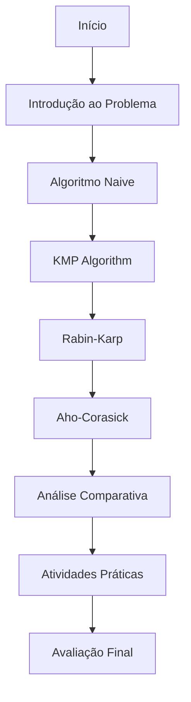

# WebQuest: Algoritmos de Busca em Strings

!!! info "Bem-vindo(a) ao WebQuest sobre Busca em Strings!"
    Neste WebQuest, você irá explorar, implementar e analisar algoritmos clássicos de busca em strings usando Python. Prepare-se para uma jornada através dos algoritmos Naive, KMP, Rabin-Karp e Aho-Corasick!

## 🎯 O que você vai aprender

- **Compreender** os fundamentos da busca em strings
- **Implementar** algoritmos clássicos em Python
- **Analisar** complexidades e performance
- **Comparar** diferentes abordagens
- **Aplicar** os conhecimentos em problemas reais

## 🚀 Metodologia WebQuest

Esta experiência de aprendizagem segue a metodologia WebQuest, que combina:

- **Investigação orientada** através de recursos selecionados
- **Aprendizagem ativa** com implementações práticas
- **Análise crítica** de algoritmos e suas aplicações
- **Síntese do conhecimento** através de comparações

## 📚 Algoritmos Estudados

=== "Algoritmo Naive"
    O método mais simples e intuitivo para busca em strings.
    
    - **Complexidade**: O(n×m)
    - **Vantagem**: Simplicidade de implementação
    - **Desvantagem**: Ineficiente para textos grandes

=== "KMP (Knuth-Morris-Pratt)"
    Algoritmo eficiente que evita retrocessos desnecessários.
    
    - **Complexidade**: O(n+m)
    - **Vantagem**: Linear, sem backtracking
    - **Aplicação**: Busca única de padrão

=== "Rabin-Karp"
    Utiliza hashing para comparação eficiente de substrings.
    
    - **Complexidade**: O(n+m) médio
    - **Vantagem**: Múltiplos padrões, rolling hash
    - **Aplicação**: Detecção de plágio

=== "Aho-Corasick"
    Busca múltiplos padrões simultaneamente usando autômato finito.
    
    - **Complexidade**: O(n+m+z)
    - **Vantagem**: Múltiplos padrões em uma única passada
    - **Aplicação**: Filtros de conteúdo, bioinformática

## 🛣️ Roteiro de Estudos

## 🎓 Como usar este WebQuest

1. **Navegue sequencialmente** pelos algoritmos
2. **Execute os códigos** fornecidos
3. **Experimente variações** dos exemplos
4. **Complete as atividades** propostas
5. **Reflita sobre** as questões apresentadas

!!! tip "Dica de Estudo"
    Mantenha um caderno de anotações para registrar suas descobertas e dúvidas. A programação se aprende praticando!

## 📊 Recursos Interativos

- **Visualizações** dos algoritmos em ação
- **Códigos comentados** linha por linha
- **Comparativos de performance** com gráficos
- **Exercícios práticos** com soluções
- **Testes automatizados** para validação

---

**Pronto para começar?** Vamos iniciar pela [Introdução ao Problema](introducao/problema.md)! 🚀