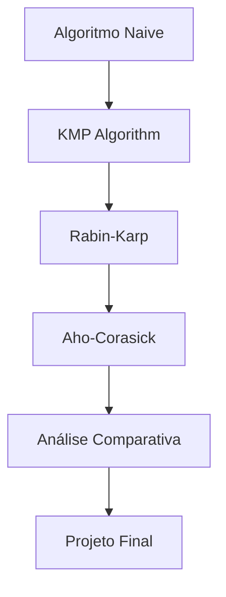

# Metodologia WebQuest

## O que é uma WebQuest?

Uma **WebQuest** é uma metodologia de ensino-aprendizagem baseada na **investigação orientada** e no uso da internet como fonte primária de informação. Desenvolvida por Bernie Dodge em 1995, essa abordagem promove:

- **Aprendizagem ativa** e construtiva
- **Pensamento crítico** e analítico  
- **Colaboração** e trabalho em equipe
- **Autonomia** no processo de aprendizagem

## Estrutura de uma WebQuest

### 1. Introdução 🎯
**Objetivo**: Motivar e contextualizar o tema

Nesta seção você encontrará:
- Apresentação do problema
- Relevância do tema
- Contexto histórico e aplicações

### 2. Tarefa 📋
**Objetivo**: Definir claramente o que deve ser realizado

As tarefas incluem:
- **Compreender** algoritmos de busca em strings
- **Implementar** soluções em Python
- **Analisar** complexidades e performance
- **Comparar** diferentes abordagens
- **Aplicar** em problemas reais

### 3. Processo 🔄
**Objetivo**: Guiar o caminho de aprendizagem

O processo está organizado em etapas:

### 4. Recursos 📚
**Objetivo**: Fornecer fontes confiáveis de informação

Recursos incluem:
- **Visualizações interativas**
- **Artigos acadêmicos**
- **Implementações de referência**
- **Vídeos explicativos**
- **Simuladores online**

### 5. Avaliação 📊
**Objetivo**: Verificar o aprendizado e promover reflexão

Critérios de avaliação:
- **Compreensão conceitual**
- **Qualidade das implementações**
- **Análise crítica**
- **Aplicação prática**

### 6. Conclusão 🎓
**Objetivo**: Consolidar conhecimentos e inspirar continuidade

## Princípios Pedagógicos

### Construtivismo
O conhecimento é construído ativamente pelo aprendiz através da:
- **Exploração** de conceitos
- **Experimentação** com códigos
- **Reflexão** sobre resultados
- **Conexão** com conhecimentos prévios

### Aprendizagem Significativa
Os conteúdos são apresentados de forma a:
- **Conectar** teoria e prática
- **Relacionar** com situações reais
- **Motivar** através de aplicações relevantes
- **Facilitar** a transferência de conhecimento

### Zona de Desenvolvimento Proximal
As atividades são estruturadas para:
- **Desafiar** sem frustrar
- **Apoiar** com recursos adequados
- **Progredir** gradualmente em complexidade
- **Adaptar** ao ritmo individual

## Estratégias de Aprendizagem

### 1. Aprendizagem por Descoberta
Você será incentivado a:
- **Investigar** implementações
- **Experimentar** variações
- **Descobrir** padrões e relações
- **Formular** hipóteses próprias

### 2. Aprendizagem Colaborativa
Oportunidades para:
- **Discussar** soluções em fóruns
- **Compartilhar** implementações
- **Revisar** código de colegas
- **Colaborar** em projetos

### 3. Metacognição
Desenvolvimento da capacidade de:
- **Refletir** sobre o próprio aprendizado
- **Monitorar** o progresso
- **Ajustar** estratégias de estudo
- **Avaliar** a compreensão

## Como Navegar nesta WebQuest

### 📱 Interface Responsiva
- **Desktop**: Navegação completa com sidebar
- **Mobile**: Menu adaptativo e conteúdo otimizado
- **Tablet**: Experiência híbrida

### 🔍 Funcionalidades de Busca
- **Busca global**: Encontre conteúdo em toda a WebQuest
- **Glossário**: Definições rápidas de termos técnicos
- **Índice**: Navegação estruturada por tópicos

### 💻 Recursos Interativos
- **Editor de código**: Teste implementações online
- **Visualizações**: Animações dos algoritmos
- **Benchmarks**: Compare performance em tempo real

### 📊 Acompanhamento de Progresso
- **Checklist**: Marque tarefas concluídas
- **Timeline**: Visualize seu progresso
- **Badges**: Conquiste recompensas por marcos

## Dicas para o Sucesso

!!! tip "Estratégias Eficazes"
    **1. Planejamento**
    - Reserve tempo regular para estudo
    - Defina metas semanais
    - Use ferramentas de organização

    **2. Prática Ativa**
    - Implemente todos os algoritmos
    - Teste com diferentes inputs
    - Modifique e experimente variações

    **3. Reflexão Constante**
    - Mantenha um diário de aprendizagem
    - Questione suas implementações
    - Conecte conceitos entre algoritmos

    **4. Colaboração**
    - Participe de discussões
    - Ajude colegas com dificuldades
    - Busque feedback sobre seu código

## Recursos de Apoio

### 🆘 Quando Precisar de Ajuda
1. **Consulte o glossário** para termos técnicos
2. **Revise os recursos de apoio** de cada seção
3. **Use os fóruns de discussão** para dúvidas específicas
4. **Contate o instrutor** para questões complexas

### 🔧 Ferramentas Recomendadas
- **IDE**: PyCharm, VSCode, ou Jupyter Notebook
- **Visualização**: Python Tutor, VisuAlgo
- **Colaboração**: GitHub, Google Colab
- **Organização**: Notion, Trello, ou Todoist
