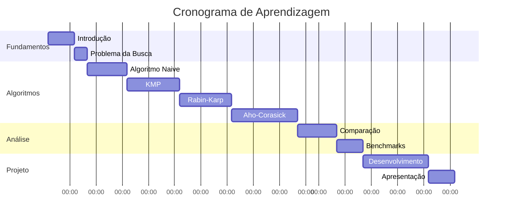

# Objetivos de Aprendizagem

## Objetivos Gerais

Ao concluir esta WebQuest, você será capaz de **dominar os algoritmos fundamentais de busca em strings**, compreendendo suas características, implementações e aplicações práticas no desenvolvimento de software e análise de dados.

## Objetivos Específicos

### 🎯 Conhecimento Conceitual

#### 1. Compreender Fundamentos Teóricos
- **Definir** o problema de busca em strings e sua importância
- **Explicar** os conceitos de padrão, texto e complexidade algorítmica
- **Identificar** cenários onde cada algoritmo é mais apropriado
- **Relacionar** busca em strings com outras áreas da computação

#### 2. Dominar Complexidade Algorítmica
- **Analisar** complexidade temporal e espacial de cada algoritmo
- **Comparar** performance entre diferentes abordagens
- **Calcular** complexidade para casos específicos
- **Interpretar** notação Big O, Omega e Theta

### 💻 Habilidades Práticas

#### 3. Implementar Algoritmos
- **Codificar** o algoritmo Naive de forma eficiente
- **Construir** a tabela LPS para o algoritmo KMP
- **Implementar** rolling hash no Rabin-Karp
- **Desenvolver** autômato finito para Aho-Corasick

#### 4. Otimizar e Depurar Código
- **Identificar** gargalos de performance
- **Aplicar** técnicas de otimização
- **Usar** ferramentas de profiling
- **Corrigir** bugs em implementações complexas

### 🔍 Análise e Avaliação

#### 5. Realizar Análise Comparativa
- **Medir** performance em diferentes cenários
- **Criar** benchmarks representativos
- **Documentar** resultados de forma clara
- **Justificar** escolhas algorítmicas

#### 6. Avaliar Aplicabilidade
- **Selecionar** algoritmo apropriado para cada problema
- **Considerar** trade-offs entre tempo e espaço
- **Avaliar** escalabilidade das soluções
- **Propor** otimizações específicas

### 🚀 Aplicação Prática

#### 7. Resolver Problemas Reais
- **Desenvolver** filtro de conteúdo usando Aho-Corasick
- **Implementar** detector de plágio com Rabin-Karp
- **Criar** ferramenta de busca em logs
- **Construir** analisador de sequências biológicas

#### 8. Apresentar Soluções
- **Documentar** implementações de forma profissional
- **Criar** visualizações dos algoritmos
- **Explicar** escolhas de design
- **Demonstrar** funcionamento através de exemplos

## Taxonomia de Bloom Aplicada

### Nível 1: Lembrar 🧠
- [ ] Listar os quatro algoritmos estudados
- [ ] Definir termos: padrão, texto, ocorrência
- [ ] Identificar complexidades básicas

### Nível 2: Compreender 💡
- [ ] Explicar como funciona cada algoritmo
- [ ] Distinguir entre diferentes abordagens
- [ ] Interpretar diagramas e visualizações

### Nível 3: Aplicar 🔧
- [ ] Implementar todos os algoritmos em Python
- [ ] Usar algoritmos em problemas específicos
- [ ] Aplicar em datasets reais

### Nível 4: Analisar 🔍
- [ ] Comparar performance dos algoritmos
- [ ] Examinar casos de melhor/pior performance
- [ ] Decompor problemas complexos

### Nível 5: Avaliar 📊
- [ ] Criticar implementações existentes
- [ ] Julgar qual algoritmo usar em cada cenário
- [ ] Validar resultados e medições

### Nível 6: Criar 🎨
- [ ] Desenvolver variações dos algoritmos
- [ ] Construir aplicações completas
- [ ] Sintetizar conhecimentos em projeto final

## Competências Transversais

### 🧮 Pensamento Computacional
- **Decomposição**: Quebrar problemas complexos em partes menores
- **Reconhecimento de padrões**: Identificar similaridades entre algoritmos
- **Abstração**: Focar nos aspectos essenciais
- **Algoritmos**: Criar sequências lógicas de passos

### 📈 Análise de Dados
- **Coleta**: Obter métricas de performance
- **Processamento**: Limpar e organizar dados
- **Visualização**: Criar gráficos informativos
- **Interpretação**: Extrair insights dos resultados

### 🔬 Método Científico
- **Hipóteses**: Formular previsões sobre performance
- **Experimentação**: Testar hipóteses sistematicamente
- **Observação**: Coletar dados precisos
- **Conclusão**: Validar ou refutar hipóteses

## Indicadores de Sucesso

### ✅ Critérios de Avaliação

#### Implementação (40%)
- **Corretude**: Algoritmos funcionam corretamente
- **Eficiência**: Implementações são otimizadas
- **Clareza**: Código é legível e bem documentado
- **Robustez**: Tratamento adequado de casos extremos

#### Análise (30%)
- **Precisão**: Medições são acuradas
- **Profundidade**: Análise vai além do superficial
- **Comparação**: Avaliação equilibrada dos algoritmos
- **Visualização**: Apresentação clara dos resultados

#### Aplicação (20%)
- **Relevância**: Problemas escolhidos são significativos
- **Criatividade**: Soluções são inovadoras
- **Completude**: Projetos são bem desenvolvidos
- **Funcionalidade**: Aplicações funcionam adequadamente

#### Reflexão (10%)
- **Autoavaliação**: Consciência do próprio aprendizado
- **Metacognição**: Reflexão sobre processos de pensamento
- **Conexões**: Ligação com outros conhecimentos
- **Aplicabilidade**: Visão de uso futuro

## Cronograma Sugerido

## Recursos de Autoavaliação

### 📋 Checklist de Progresso

#### Algoritmo Naive
- [ ] Compreendi o conceito básico
- [ ] Implementei corretamente
- [ ] Analisei a complexidade O(n×m)
- [ ] Identifiquei limitações

#### KMP (Knuth-Morris-Pratt)
- [ ] Entendi a tabela LPS
- [ ] Implementei build_lps_table()
- [ ] Codifiquei o algoritmo principal
- [ ] Compreendi a complexidade O(n+m)

#### Rabin-Karp
- [ ] Compreendi rolling hash
- [ ] Implementei função hash
- [ ] Tratei colisões adequadamente
- [ ] Analisei casos médio e pior

#### Aho-Corasick
- [ ] Entendi a estrutura trie
- [ ] Implementei failure links
- [ ] Codifiquei busca simultânea
- [ ] Apliquei em múltiplos padrões

### 🎯 Metas de Aprendizagem

!!! success "Ao Final desta WebQuest"
    Você terá desenvolvido uma **expertise sólida em algoritmos de busca em strings**, capacitando-o para:
    
    - Escolher o algoritmo mais adequado para cada situação
    - Implementar soluções eficientes e robustas
    - Otimizar performance em aplicações reais
    - Contribuir para projetos que envolvem processamento de texto
    - Prosseguir para tópicos avançados como processamento de linguagem natural e bioinformática